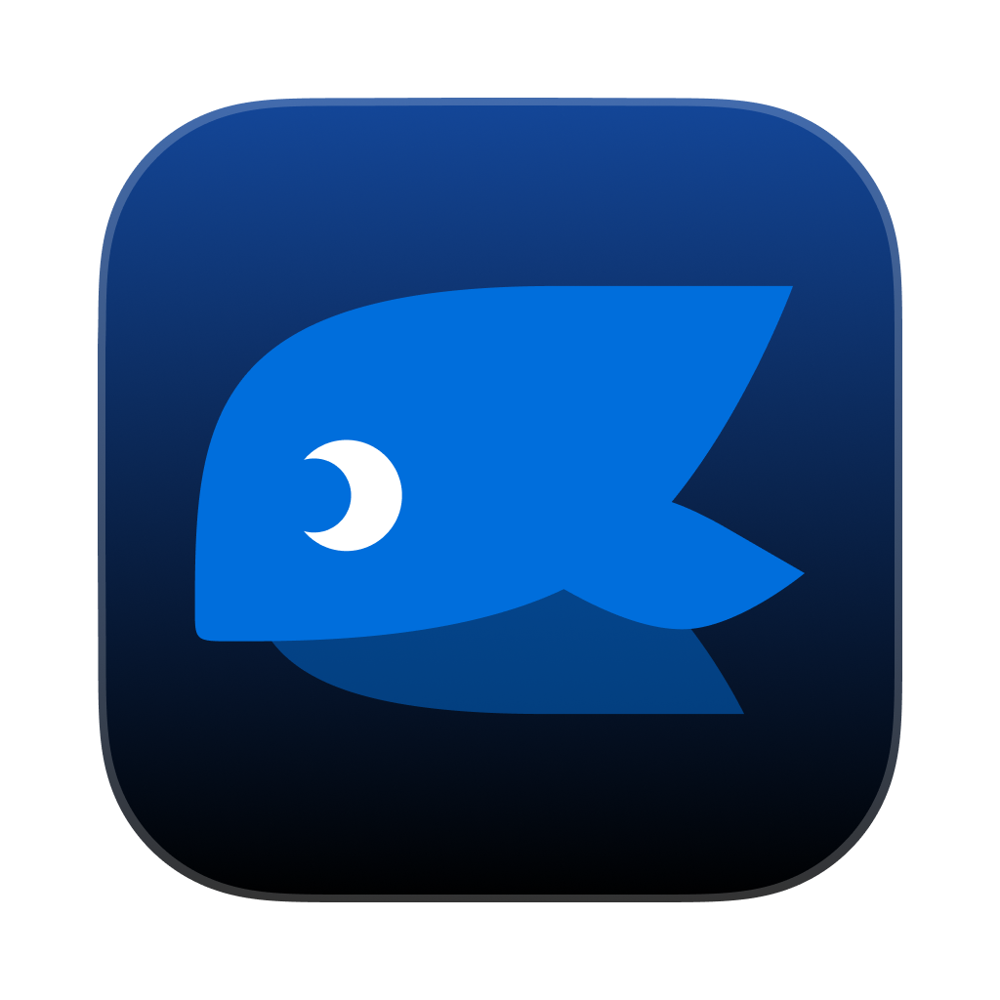
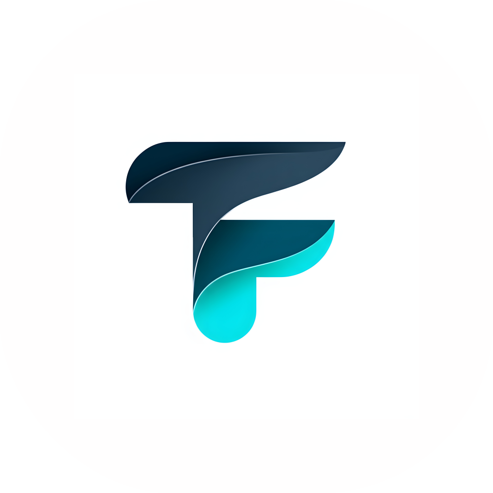

<p align='center'>

</p>

<h1 align="center">DeepChat - オープンソースのローカルファーストAgentデスクトップクライアント</h1>

<p align="center">DeepChatは、豊富なAgent機能を備えたオープンソースのローカルファーストAgentデスクトップクライアントです。Tape.systemsの哲学に基づいて設計され、MCP、Skills、ACP、メッセージアプリ向けのリモートコントロールをサポートします。</p>

<p align="center">
  <a href="https://github.com/ThinkInAIXYZ/deepchat/stargazers"></a>
  <a href="https://github.com/ThinkInAIXYZ/deepchat/network/members"></a>
  <a href="https://github.com/ThinkInAIXYZ/deepchat/pulls"></a>
  <a href="https://github.com/ThinkInAIXYZ/deepchat/issues"></a>
  <a href="https://github.com/ThinkInAIXYZ/deepchat/blob/main/LICENSE"></a>
  <a href="https://github.com/ThinkInAIXYZ/deepchat/releases/latest"></a>
  <a href="https://deepwiki.com/ThinkInAIXYZ/deepchat"></a>
</p>

<div align="center">
  <a href="https://trendshift.io/repositories/15162" target="_blank"></a>
</div>

<div align="center">
  <a href="./README.zh.md">中文</a> / <a href="./README.md">English</a> / <a href="./README.jp.md">日本語</a>
</div>

## 📑 目次

- [📑 目次](#-目次)
- [🚀 プロジェクト紹介](#-プロジェクト紹介)
- [💡 なぜDeepChatを選ぶのか](#-なぜdeepchatを選ぶのか)
- [🔥 主な機能](#-主な機能)
- [📼 Tape と Trace](#-tape-と-trace)
- [🧠 Skills サポート](#-skills-サポート)
- [🧩 ACP 連携（Agent Client Protocol）](#-acp-連携agent-client-protocol)
- [📡 リモートコントロール](#-リモートコントロール)
- [🤖 サポートされているモデルプロバイダー](#-サポートされているモデルプロバイダー)
  - [OpenAI/Gemini/Anthropic API形式の任意のモデルプロバイダーと互換性あり](#openaigeminianthropic-api形式の任意のモデルプロバイダーと互換性あり)
- [🔍 ユースケース](#-ユースケース)
- [📦 クイックスタート](#-クイックスタート)
  - [ダウンロードとインストール](#ダウンロードとインストール)
  - [モデルの設定](#モデルの設定)
  - [会話を開始](#会話を開始)
- [💻 開発ガイド](#-開発ガイド)
  - [依存関係のインストール](#依存関係のインストール)
  - [開発を開始](#開発を開始)
  - [ビルド](#ビルド)
- [👥 コミュニティと貢献](#-コミュニティと貢献)
- [⭐ スター履歴](#-スター履歴)
- [👨‍💻 貢献者](#-貢献者)
- [📃 ライセンス](#-ライセンス)

## 🚀 プロジェクト紹介

DeepChatは、モデル・ツール・Skills・エージェントランタイム・Tape・長時間セッションを1つのデスクトップアプリに統合する、強力なオープンソースのローカルファーストAgentデスクトップクライアントです。OpenAI、Gemini、AnthropicなどのクラウドAPIや、ローカルにデプロイされたOllamaモデルを使用する場合でも、DeepChatはスムーズなユーザー体験を提供します。

DeepChatのセッションとAgentプロセスはTape.systemsの哲学に基づいています。プロセスを残すことで、コンテキスト、ツール呼び出し、リクエスト、結果を復元・追跡・検査できます。さらに、優れたMCPサポート、インストール可能なSkills、ACP Agent連携、Telegram、Feishu/Lark、QQBot、Discord、WeChat iLinkなどのIMツールからのリモートコントロールを提供します。

<table align="center">
  <tr>
    <td align="center" style="padding: 10px;">
      
      <br/>
    </td>
    <td align="center" style="padding: 10px;">
      
      <br/>
    </td>
  </tr>
</table>

## 💡 なぜDeepChatを選ぶのか

他のAIツールと比較して、DeepChatは以下のようなユニークな利点を提供します：

- **ローカルファーストAgentデスクトップクライアント**: DeepChat Agent、ACP Agent、リモート対応Botを1つのローカルアプリで実行できます
- **Tape.systemsの哲学**: 復元可能なセッション履歴を保持し、リクエストコンテキストとtoken予算を検査できます
- **持ち運べるSkills**: 会話ごとにSkillsをインストール、インポート、エクスポート、有効化し、コードレビュー、文書、フロントエンド、Office/PDFなどに対応できます
- **ネイティブACP連携**: ACP互換のコーディング/タスクエージェントを「モデル」と同じ入口から使用できます
- **優れたMCPサポート**: Resources、Prompts、Tools、複数Transport、inMemoryサービス、ワンクリックインストールに対応します
- **リモート対応ワークフロー**: Telegram、Feishu/Lark、QQBot、Discord、WeChat iLink からDeepChatセッションを操作できます
- **統一されたマルチモデル管理**: 主要なクラウドLLMとローカルOllamaモデルを1つのアプリで扱えます
- **プライバシー重視**: ローカルデータストレージとネットワークプロキシのサポートにより、情報漏洩のリスクを軽減します
- **ビジネスフレンドリー**: Apache License 2.0の下でオープンソース化され、商用・個人利用の両方に適しています

## 🔥 主な機能

- 🤖 **ローカルファーストAgentデスクトップクライアント**
  - DeepChat、ACP、リモート対応エージェントを1つのモデル選択に近い入口から選択
  - プロジェクトフォルダー、権限モード、ツール出力、復元可能なコンテキストを備えた長時間セッションに対応
- 📼 **Tape と Trace**
  - Session Tapeが構造化された作業履歴を記録し、復元、再開、将来のAgent memoryフローを支えます
  - Traceプレビューでリクエスト番号、プロバイダー/モデル情報、Tape view manifest、含まれるエントリー、token予算を確認できます
- 🧠 **Skills**
  - フォルダー、ZIPファイル、URLからSkillsをインストール可能
  - 会話ごとにSkillsを有効化し、タスク専用の手順、参考資料、任意のスクリプトを読み込み可能
  - Claude Code、Codex、Cursor、Windsurf、GitHub Copilotなどの互換ツールとインポート/エクスポート可能
- 🤝 **ACP（Agent Client Protocol）エージェント連携**
  - ACP互換エージェント（内蔵/カスタムコマンド）を「モデル」として選択可能
  - エージェントが提供する場合、ACP Workspace UI で構造化プラン、ツール呼び出し、ターミナル出力を表示
- 📡 **リモートコントロール**
  - Telegram、Feishu/Lark、QQBot、Discord、WeChat iLink からDeepChatセッションを操作可能
  - リモートエンドポイントをセッションに紐づけ、モデル切り替え、保留中の操作対応、生成停止、デスクトップ表示を実行可能
- 🌐 **複数のクラウドLLMプロバイダーサポート**: DeepSeek、OpenAI、Moonshot/Kimi、Grok、Gemini、Anthropicなど
- 🏠 **ローカルモデルデプロイメントサポート**:
  - 包括的な管理機能を備えた統合Ollama
  - コマンドライン操作なしでOllamaモデルのダウンロード、デプロイメント、実行を制御・管理
- 🚀 **豊富で使いやすいチャット機能**
  - 業界最高レベルの [CodeMirror](https://codemirror.net/) を基盤としたコードブロックレンダリングを含む完全なMarkdownレンダリング
  - マルチウィンドウ + マルチタブアーキテクチャで、あらゆる次元でマルチセッション並列動作をサポート。ブラウザのように大規模モデルを使用し、ノンブロッキング体験により優れた効率を実現
  - 多様な結果表示のためのアーティファクトレンダリングをサポート
  - メッセージは複数のバリエーションを生成するためのリトライをサポート。会話は自由にフォーク可能で、常に適切な思考の流れを確保
  - 画像、Mermaidダイアグラム、その他のマルチモーダルコンテンツのレンダリングをサポート。GPT-4o、Gemini、Grokのテキストから画像生成機能をサポート
  - 検索結果などの外部情報ソースをコンテンツ内でハイライト表示
- 🔍 **強力な検索強化機能**
  - 博查搜索、Brave Searchなどの主要な検索APIを組み込み、モデルが検索のタイミングを賢く判断
  - ユーザーのウェブブラウジングをシミュレートすることで、Google、Bing、Baidu、Sogou公式アカウント検索などの主要検索エンジンをサポート
  - あらゆる検索エンジンの読み取りをサポート。検索アシスタントモデルを設定するだけで、内部ネットワーク、APIなしのエンジン、垂直ドメイン検索エンジンなど、様々な情報ソースをモデルに接続可能
- 🔧 **優れたMCP（Model Context Protocol）サポート**
  - Resources / Prompts / Tools の三大コア機能をサポート
  - StreamableHTTP、SSE、StdioなどのTransportに対応
  - 組み込みNode.jsランタイムにより、npx/node系サービスがすぐに利用可能
  - コード実行、Web情報取得、ファイル操作などのinMemoryサービスに対応
  - ツール呼び出し、パラメータ、戻り値を見やすくデバッグ可能
  - DeepLinkによるMCPサービスのワンクリックインストールに対応
- 💻 **マルチプラットフォームサポート**: Windows、macOS、Linux
- 🎨 **美しく使いやすいインターフェース**、ユーザー志向の設計、丁寧なライト/ダークモードテーマ
- 🔗 **豊富なDeepLinkサポート**: リンクを通じて会話を開始し、他のアプリケーションとシームレスに統合。MCPサービスのワンクリックインストールにも対応
- 🚑 **セキュリティ重視の設計**: チャットデータと設定データに暗号化インターフェースとコード難読化機能を備える
- 🛡️ **プライバシー保護**: スクリーン投影の非表示、ネットワークプロキシなどのプライバシー保護方法をサポートし、情報漏洩のリスクを軽減
- 💰 **ビジネスフレンドリー**:
  - オープンソースを採用し、Apache License 2.0ライセンスに基づく、企業利用も安心
  - 企業統合では最小限の設定コード変更のみで予約された暗号化難読化セキュリティ機能を使用可能
  - コード構造が明確で、モデルプロバイダーもMCPサービスも高度に分離されており、最小コストで自由にカスタマイズ可能
  - 合理的なアーキテクチャ、データ相互作用とUI動作の分離により、Electronの機能を十分に活用し、単純なウェブラッパーを拒否、優れたパフォーマンス

## 📼 Tape と Trace

DeepChatのSession TapeはTape.systemsの哲学を継承し、エージェント作業を復元可能かつ検査可能にします。Traceプレビューでは、リクエスト番号、プロバイダー/モデル情報、Tape view manifest、含まれる/除外されるコンテキストエントリー、token予算を確認でき、長時間セッションのデバッグと再開が容易になります。

## 🧠 Skills サポート

DeepChat Skills は標準の Agent Skills 仕様と互換性のある設計です。Skillにはタスク手順、参考資料、アセット、任意のスクリプトを含めることができ、有効化するとDeepChatがその分野の専門アシスタントのように振る舞えます。

Skillsはフォルダー、ZIPファイル、URLからインストールできます。Claude Code、Codex、Cursor、Windsurf、GitHub Copilot、Kiro、Antigravity、OpenCode、Goose、Kilo Code などの互換ツールとのインポート/エクスポートにも対応します。

組み込みSkillsは、生成アート、コードレビュー、DeepChat設定、ドキュメント共同作成、DOCX、フロントエンド設計、git commitメッセージ、インフォグラフィック構文、MCP構築、PDF、PPTX、Skill作成、Web Artifacts、XLSXワークフローをカバーします。

クイックスタート：

1. **設定 → Skills** を開く
2. Skillをインストールまたはインポートする
3. 必要な会話でそのSkillを有効化する

## 🧩 ACP 連携（Agent Client Protocol）

DeepChatは [Agent Client Protocol（ACP）](https://agentclientprotocol.com) を内蔵しており、外部のエージェントランタイムをDeepChatにネイティブに統合できます。有効化すると、ACPエージェントはモデルセレクターに「モデル」として表示され、DeepChat内でコーディング/タスク系エージェントをWorkspace UIと一緒に利用できます。

クイックスタート：

1. **設定 → ACPエージェント** でACPを有効化
2. 内蔵ACPエージェントを有効化するか、ACP互換コマンドを追加
3. モデルセレクターでACPエージェントを選択してセッションを開始

ACP互換のエージェント/クライアント一覧：https://agentclientprotocol.com/overview/clients

## 📡 リモートコントロール

DeepChatはメッセージアプリからリモート操作できるため、デスクトップから離れていても同じセッションを継続できます。設定は **設定 → Remote** から行います。

対応チャンネルは Telegram、Feishu/Lark、QQBot、Discord、WeChat iLink です。リモートエンドポイントは1つのDeepChatセッションに紐づけられ、リモートチャットから新規セッション作成、最近のセッション一覧と切り替え、生成停止、現在のセッションをデスクトップで開く、保留中の質問や権限リクエストへの回答、モデル切り替え、実行状態の確認ができます。

主なコマンドは `/start`、`/help`、`/pair`、`/new`、`/sessions`、`/use`、`/stop`、`/open`、`/pending`、`/model`、`/status` です。

## 🤖 サポートされているモデルプロバイダー

<table>
  <tr align="center">
    <td>
      <br/>
      <a href="https://deepseek.com/">Deepseek</a>
    </td>
    <td>
      <br/>
      <a href="https://moonshot.ai/">Moonshot</a>
    </td>
    <td>
      <br/>
      <a href="https://openai.com/">OpenAI</a>
    </td>
    <td>
      <br/>
      <a href="https://gemini.google.com/">Gemini</a>
    </td>
  </tr>
  <tr align="center">
    <td>
      <br/>
      <a href="https://ollama.com/">Ollama</a>
    </td>
    <td>
      <br/>
      <a href="https://www.qiniu.com">Qiniu</a>
    </td>
    <td>
      <br/>
      <a href="https://www.newapi.ai/">New API</a>
    </td>
    <td>
      <br/>
      <a href="https://x.ai/">Grok</a>
    </td>
  </tr>
  <tr align="center">
    <td>
      <br/>
      <a href="https://open.bigmodel.cn/">Zhipu</a>
    </td>
    <td>
      <br/>
      <a href="https://ppinfra.com/">PPIO</a>
    </td>
    <td>
      <br/>
      <a href="https://platform.minimaxi.com/">MiniMax</a>
    </td>
    <td>
      <br/>
      <a href="https://fireworks.ai/">Fireworks</a>
    </td>
  </tr>
  <tr align="center">
    <td>
      <br/>
      <a href="https://aihubmix.com/">AIHubMix</a>
    </td>
    <td>
      <br/>
      <a href="https://console.volcengine.com/ark/">Doubao</a>
    </td>
    <td>
      <br/>
      <a href="https://www.aliyun.com/product/bailian">DashScope</a>
    </td>
    <td>
      <br/>
      <a href="https://groq.com/">Groq</a>
    </td>
  </tr>
  <tr align="center">
    <td>
      <br/>
      <a href="https://jiekou.ai?utm_source=github_deepchat">JieKou.AI</a>
    </td>
    <td>
      <br/>
      <a href="https://zenmux.ai/">ZenMux</a>
    </td>
    <td>
      <br/>
      <a href="https://github.com/marketplace/models">GitHub Models</a>
    </td>
    <td>
      <br/>
      <a href="https://lmstudio.ai/docs/app">LM Studio</a>
    </td>
  </tr>
  <tr align="center">
    <td>
      <br/>
      <a href="https://cloud.tencent.com/product/hunyuan">Hunyuan</a>
    </td>
    <td>
      <br/>
      <a href="https://302ai.cn/">302.AI</a>
    </td>
    <td>
      <br/>
      <a href="https://www.together.ai/">Together</a>
    </td>
    <td>
      <br/>
      <a href="https://poe.com/">Poe</a>
    </td>
  </tr>
  <tr align="center">
    <td>
      <br/>
      <a href="https://vercel.com/ai">Vercel AI Gateway</a>
    </td>
    <td>
      <br/>
      <a href="https://openrouter.ai/">OpenRouter</a>
    </td>
    <td>
      <br/>
      <a href="https://azure.microsoft.com/en-us/products/ai-services/openai-service">Azure OpenAI</a>
    </td>
    <td>
      <br/>
      <a href="https://tokenflux.ai/">TokenFlux</a>
    </td>
  </tr>
  <tr align="center">
    <td>
      <br/>
      <a href="https://www.burncloud.com/">BurnCloud</a>
    </td>
    <td>
      <br/>
      <a href="https://openai.com/">OpenAI Responses</a>
    </td>
    <td>
      <br/>
      <a href="https://open.cherryin.ai/console">CherryIn</a>
    </td>
    <td>
      <br/>
      <a href="https://modelscope.cn/">ModelScope</a>
    </td>
  </tr>
  <tr align="center">
    <td>
      <br/>
      <a href="https://aws.amazon.com/bedrock/">AWS Bedrock</a>
    </td>
    <td>
      <br/>
      <a href="https://voice.ai/">Voice.ai</a>
    </td>
    <td>
      <br/>
      <a href="https://cloud.google.com/vertex-ai">Vertex AI</a>
    </td>
    <td>
      <br/>
      <a href="https://github.com/features/copilot">GitHub Copilot</a>
    </td>
  </tr>
  <tr align="center">
    <td>
      <br/>
      <a href="https://platform.xiaomimimo.com/#/docs/quick-start/first-api-call">Xiaomi</a>
    </td>
    <td>
      <br/>
      <a href="https://o3.fan">o3.fan</a>
    </td>
    <td>
      <br/>
      <a href="https://novita.ai/">Novita AI</a>
    </td>
    <td>
      <br/>
      <a href="https://astraflow.ucloud.cn/">Astraflow</a>
    </td>
  </tr>
  <tr align="center">
    <td>
      <br/>
      <a href="https://www.anthropic.com/">Anthropic</a>
    </td>
    <td>
      <br/>
      <a href="https://www.siliconflow.cn/">SiliconFlow</a>
    </td>
  </tr>

</table>

### OpenAI/Gemini/Anthropic API形式の任意のモデルプロバイダーと互換性あり

## 🔍 ユースケース

DeepChatは様々なAIアプリケーションシナリオに適しています：

- **日常アシスタント**: 質問への回答、提案の提供、文章作成の支援
- **開発支援**: コード生成、デバッグ、技術的問題の解決
- **学習ツール**: 概念の説明、知識の探求、学習ガイダンス
- **コンテンツ作成**: コピーライティング、クリエイティブなインスピレーション、コンテンツの最適化
- **データ分析**: データの解釈、チャート生成、レポート作成

## 📦 クイックスタート

### ダウンロードとインストール

以下のいずれかの方法で DeepChat をインストールできます：

**方法1：GitHub Releases**

[GitHub Releases](https://github.com/ThinkInAIXYZ/deepchat/releases)ページからお使いのシステム用の最新バージョンをダウンロードしてください：

- Windows: `.exe`インストールファイル
- macOS: `.dmg`インストールファイル
- Linux: `.AppImage`または`.deb`インストールファイル

**方法2：公式ウェブサイト**

[公式ウェブサイト](https://deepchatai.cn/#/download)からダウンロードできます。

**方法3：Homebrew（macOS のみ）**

macOS ユーザーは Homebrew を使用してインストールできます：

```bash
brew install --cask deepchat
```

### モデルの設定

1. DeepChatアプリケーションを起動
2. 設定アイコンをクリック
3. "モデルプロバイダー"タブを選択
4. APIキーを追加するか、ローカルOllamaを設定

### 会話を開始

1. "+"ボタンをクリックして新しい会話を作成
2. 使用したいモデルを選択
3. AIアシスタントとの対話を開始

## 💻 開発ガイド

[貢献ガイドライン](./CONTRIBUTING.md)をお読みください。

WindowsとLinuxはGitHub Actionによってパッケージングされます。
Mac関連の署名とパッケージングについては、[Mac リリースガイド](https://github.com/ThinkInAIXYZ/deepchat/wiki/Mac-Release-Guide)を参照してください。

### 依存関係のインストール

```bash
$ pnpm install
$ pnpm run installRuntime
# エラーが出た場合: No module named 'distutils'
$ pip install setuptools
```

* For Windows: 非管理者ユーザーがシンボリックリンクやハードリンクを作成できるようにするには、設定で「開発者モード」を有効にするか、管理者アカウントを使用してください。それ以外の場合、pnpm の操作は失敗します。

### 開発を開始

```bash
$ pnpm run dev
```

### ビルド

```bash
# Windowsの場合
$ pnpm run build:win

# macOSの場合
$ pnpm run build:mac

# Linuxの場合
$ pnpm run build:linux

# アーキテクチャを指定してパッケージング
$ pnpm run build:win:x64
$ pnpm run build:win:arm64
$ pnpm run build:mac:x64
$ pnpm run build:mac:arm64
$ pnpm run build:linux:x64
$ pnpm run build:linux:arm64
```

## 👥 コミュニティと貢献

DeepChatはアクティブなオープンソースコミュニティプロジェクトであり、様々な形での貢献を歓迎します：

- 🐛 [問題を報告する](https://github.com/ThinkInAIXYZ/deepchat/issues)
- 💡 [機能の提案を提出する](https://github.com/ThinkInAIXYZ/deepchat/issues)
- 🔧 [コードの改善を提出する](https://github.com/ThinkInAIXYZ/deepchat/pulls)
- 📚 [ドキュメントを改善する](https://github.com/ThinkInAIXYZ/deepchat/wiki)
- 🌍 [翻訳を手伝う](https://github.com/ThinkInAIXYZ/deepchat/tree/main/locales)

プロジェクトへの参加方法について詳しく知るには、[貢献ガイドライン](./CONTRIBUTING.md)をご確認ください。

## ⭐ スター履歴

[](https://www.star-history.com/#ThinkInAIXYZ/deepchat&Timeline)

## 👨‍💻 貢献者

deepchatへの貢献をご検討いただきありがとうございます！貢献ガイドは[貢献ガイドライン](./CONTRIBUTING.md)でご確認いただけます。

<a href="https://openomy.com/thinkinaixyz/deepchat" target="_blank" style="display: block; width: 100%;" align="center">
  
</a>

## 🙏🏻 謝辞

このプロジェクトは、以下の素晴らしいライブラリとプロジェクトの支援により構築されています：

- [Vue](https://vuejs.org/)
- [Electron](https://www.electronjs.org/)
- [Electron-Vite](https://electron-vite.org/)
- [oxlint](https://github.com/oxc-project/oxc)
- [Bub](https://github.com/bubbuild/bub)。その tape model は DeepChat の session tape 設計に着想を与えました。基盤となる tape アーキテクチャに関心がある方は [tape.systems](https://tape.systems/) をご覧ください。

## 📃 ライセンス

[LICENSE](./LICENSE)
