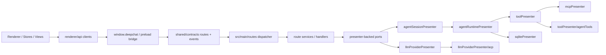

# DeepChat 当前架构概览

本文档描述 `2026-06-13` 的主架构。当前目标是维持 typed renderer-main boundary，
并把新增能力接到既有 route/runtime owner 上。

## 主链路

主结论：

- renderer 业务代码优先经过 `renderer/api/*Client`、`window.deepchat` 和 shared contracts。
- `src/main/routes/index.ts` 是 typed route dispatcher，并装配 settings、sessions、chat、
  providers、models、config、MCP、plugins、skills、skill sync、sync、browser、workspace、
  onboarding、OAuth、knowledge、upgrade、dialog、tools、database security、scheduled tasks 等 route。
- presenter 仍是 runtime owner，但 route services 只通过窄 port 或明确 client 依赖使用它们。
- `SessionPresenter` 仍保留为 legacy 数据访问、导出和兼容边界，不再是当前聊天主链路 owner。

## 模块职责

| 模块 | 位置 | 职责 |
| --- | --- | --- |
| `renderer/api` | `src/renderer/api/` | typed renderer clients，吸收 bridge/channel 细节 |
| shared contracts | `src/shared/contracts/` | route registry、schema、typed event catalog |
| preload bridge | `src/preload/createBridge.ts` / `src/preload/index.ts` | 暴露 `window.deepchat.invoke/on` |
| main routes | `src/main/routes/` | typed route dispatch、services、handlers |
| hot path ports | `src/main/routes/hotPathPorts.ts` / `src/main/presenter/runtimePorts.ts` | route runtime 到 presenter 的最小接口 |
| `AgentSessionPresenter` | `src/main/presenter/agentSessionPresenter/` | session registry、window binding、legacy import、runtime delegation |
| `AgentRuntimePresenter` | `src/main/presenter/agentRuntimePresenter/` | 聊天 loop、stream、tool interaction、message/session persistence |
| `ToolPresenter` | `src/main/presenter/toolPresenter/` | MCP tools 与本地 agent tools 聚合、权限预检查、调用路由 |
| `LLMProviderPresenter` | `src/main/presenter/llmProviderPresenter/` | provider 实例、model/runtime 管理、ACP helper、AI SDK runtime |
| `StartupWorkloadCoordinator` | `src/main/presenter/startupWorkloadCoordinator/` | startup/settings/floating 等目标的分阶段后台任务调度 |
| `RemoteControlPresenter` | `src/main/presenter/remoteControlPresenter/` | Telegram、Feishu/Lark、QQBot、Discord、WeChat iLink 远程控制 |
| `ScheduledTasksService` | `src/main/presenter/scheduledTasks/` | 一次性、每日、每周任务调度和 prompt/notify action dispatch |
| `DatabaseSecurityPresenter` | `src/main/presenter/databaseSecurityPresenter/` | SQLCipher 启用、改密、关闭、safeStorage/manual unlock |
| Spotlight search | `src/renderer/src/stores/ui/spotlight.ts` | 全局搜索、会话/消息跳转、设置导航和非破坏性 action |

## 当前分层

### 1. Renderer-Main Boundary

- `src/shared/contracts/routes*.ts` 与 `events*.ts` 是 migrated path 的契约真源。
- `src/preload/createBridge.ts` 统一 route invoke 和 typed event subscribe。
- `src/renderer/api/*Client.ts` 是组件和 store 的默认入口。
- `src/renderer/api/legacy/**` 已退休并从当前树删除；guard 会阻止它被重新创建。
- raw IPC 只允许存在于 `createBridge`、`window.api` dedicated preload API 这类明确边界内，
  业务层不得直接调用 `presenter:call`、`remoteControlPresenter:call` 或
  `window.electron.ipcRenderer`。

### 2. Main Route Runtime

- `src/main/routes/index.ts` 根据 route registry 分发请求。
- `SessionService`、`ChatService`、`ProviderService` 负责 migrated chat/session/provider hot path。
- `ProviderImportService` 负责外部 provider 配置扫描与应用。
- models routes 提供 model catalog、runtime list、config import/export、audio transcription。
- database security 与 scheduled tasks 已经是 typed route，renderer 通过专用 client 调用。

### 3. Agent Runtime

- `AgentSessionPresenter` 创建/恢复/激活 session，并把执行交给 `AgentRuntimePresenter`。
- `AgentRuntimePresenter` 拥有 stream loop、tool loop、pending input、manual/auto compaction、
  message trace 和结构化消息持久化。
- `DeepChatMessageStore` 采用头表 + 结构化子表模型，并在读路径缺行时回退旧 JSON。
- 历史搜索使用 `deepchat_search_documents` 与 FTS5，FTS 不可用时回退 `LIKE`。
- Agent progress 使用 `agent-core/update_plan`、`chat.plan.updated` 和 renderer 浮层展示任务计划。

### 4. Provider And Media Runtime

- `ModelType` 当前包含 chat、embedding、rerank、imageGeneration、videoGeneration、tts。
- OpenAI-compatible image/video generation 和 TTS 通过 model config、provider route meta、
  AI SDK runtime 与消息渲染协作。
- 本地录音转写走 `ModelClient.transcribeAudio()` / `models.transcribeAudio`，由 provider runtime 完成。
- provider deeplink 与 provider config import 都会在写入前做 preview、校验、冲突处理和脱敏展示。

### 5. Compatibility Boundary

仍保留但只承担兼容职责：

- `src/main/presenter/agentSessionPresenter/legacyImportService.ts`
- 旧 `conversations/messages` 数据域，作为 import-only 与导出数据源
- `src/main/presenter/sessionPresenter/`，作为 main 内部 compatibility/data facade
- `src/main/eventbus.ts`，继续服务未迁移路径；migrated UI 通知优先走 typed events

## 防回归规则

- 新 renderer-main 能力默认走 `renderer/api/*Client` + `window.deepchat` + shared contracts。
- legacy transport 已退休；不要重新创建 `src/renderer/api/legacy/**`，也不要新增第二个
  compatibility quarantine。确有兼容需要时，应先定义窄 typed route/event 或专用 preload API。
- `scripts/architecture-guard.mjs` 检测 direct legacy transport、已退休 legacy 目录、
  并读取 `docs/architecture/baselines/main-kernel-bridge-register.json`。
- `scripts/agent-cleanup-guard.mjs` 用于防止已退休 agent runtime 入口回流。

## 推荐阅读顺序

1. [README.md](./README.md)
2. [guides/code-navigation.md](./guides/code-navigation.md)
3. [FLOWS.md](./FLOWS.md)
4. [architecture/agent-system.md](./architecture/agent-system.md)
5. [architecture/tool-system.md](./architecture/tool-system.md)
6. [architecture/session-management.md](./architecture/session-management.md)
7. [architecture/agent-memory-system/spec.md](./architecture/agent-memory-system/spec.md)
