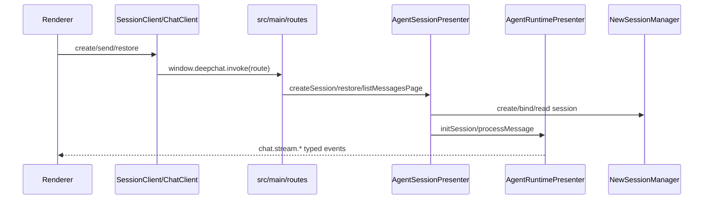
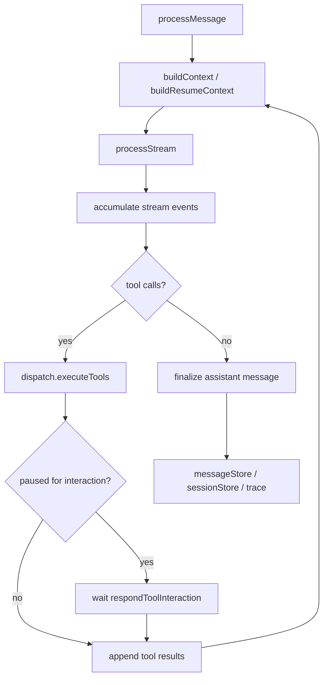
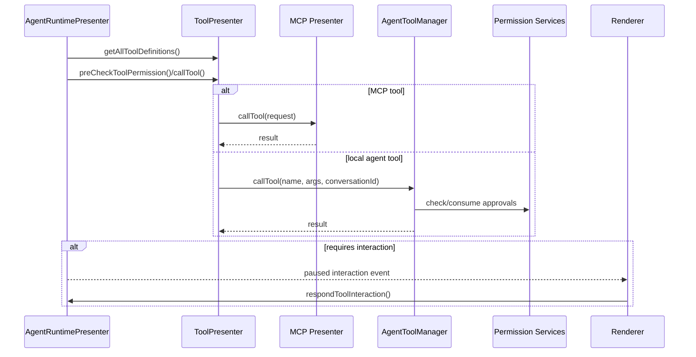
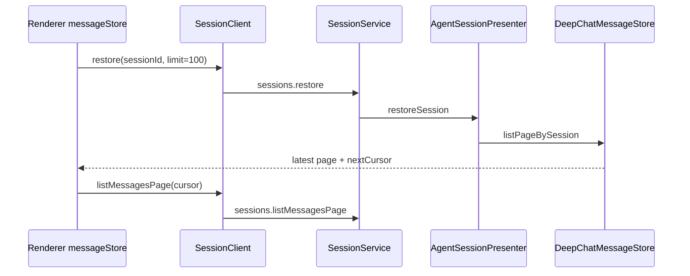
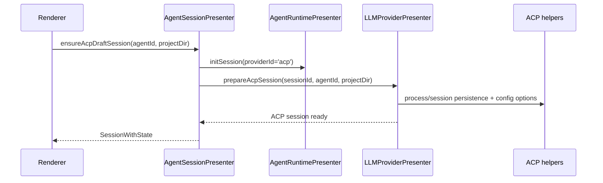
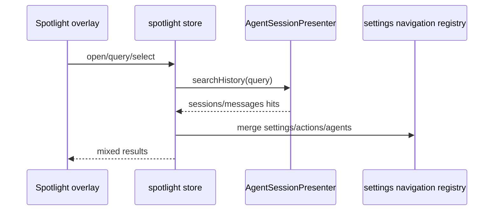
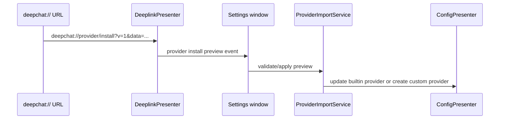
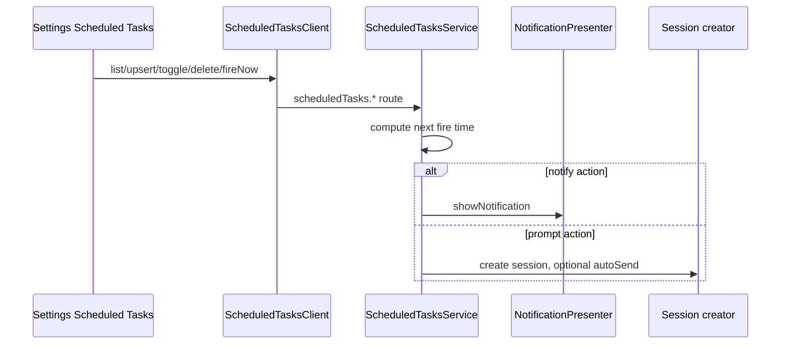
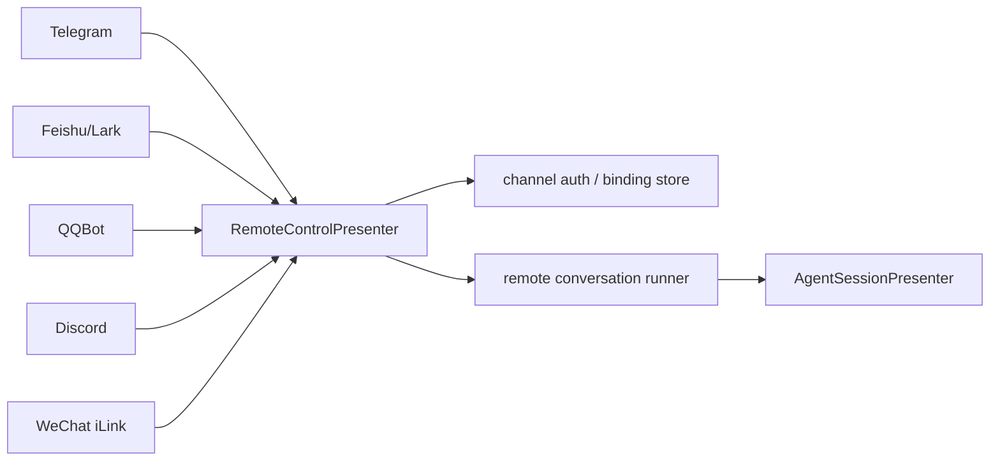

# DeepChat 当前核心流程

本文档只描述当前代码仍在使用的流程。旧 `AgentPresenter` / `startStreamCompletion`
等历史流程不再作为仓库内长期文档保留，需要追溯时用 `git log` / `git show` 查看历史提交。

## 1. 创建会话并发送消息

关键文件：

- `src/renderer/api/SessionClient.ts`
- `src/renderer/api/ChatClient.ts`
- `src/main/routes/sessions/sessionService.ts`
- `src/main/routes/chat/chatService.ts`
- `src/main/presenter/agentSessionPresenter/index.ts`
- `src/main/presenter/agentRuntimePresenter/index.ts`

## 2. DeepChat 消息处理主循环

关键语义：

- `generationSettings` 在 session 创建、草稿和 active session 中统一传递，覆盖 system prompt、
  temperature、topP、max tokens、reasoning effort、verbosity 等运行时设置。
- `sessions.compact` 触发手动上下文压缩；自动压缩设置保存在 agent/session 配置中。
- message trace 独立落库，renderer 通过 `sessions.listMessageTraces` 查询。
- 失败消息会保留恢复上下文，tool output guard 会限制过大的工具输出进入后续上下文。
- `agent-core/update_plan` 工具只更新 plan state 和 `chat.plan.updated` event，不把内部 tool call
  暴露成普通消息块。

## 3. 工具调用、权限和 Subagents

当前本地 agent tools 包括文件系统、命令执行、chat settings、subagent orchestration 等能力。
Subagent 会话以 `sessionKind='subagent'` 存储，父会话通过 tape merge/discard 处理子会话结果。

## 4. 会话恢复、分页和搜索

结构化持久化当前模型：

- `deepchat_messages` 存消息头和稳定 JSON fallback。
- `deepchat_user_messages`、`deepchat_user_message_files`、`deepchat_user_message_links`
  存 user message 热字段。
- `deepchat_assistant_blocks` 存 assistant block 增量。
- `deepchat_search_documents` / `_fts` 存历史搜索索引。

## 5. ACP Session / Runtime Preparation

ACP 配置选项走 `sessions.getAcpSessionConfigOptions` /
`sessions.setAcpSessionConfigOption`；远程控制创建 ACP session 时会使用 channel
`defaultWorkdir` 或全局默认项目路径，并拒绝没有 workdir 的 ACP 默认 agent。

## 6. Spotlight Search

Spotlight 默认由 `CommandOrControl+P` 打开，混排 recent sessions、agents、settings、actions
和历史消息。消息命中会写入 pending jump，`ChatPage` 在目标消息加载完成后滚动并高亮。

## 7. Provider Import And Deeplinks

当前支持：

- `deepchat://start`
- `deepchat://mcp/install`
- `deepchat://provider/install`
- provider config import scan/apply，包括 Codex、Claude Code、Cherry Studio、CC Switch 等来源
- model config import/export，以及 built-in/custom provider 的 credential-only import

## 8. Scheduled Tasks

Triggers 支持 once、daily、weekly；actions 支持 notification 和 prompt。Prompt action 可指定
agent、provider、model、system prompt，并通过 route runtime 创建会话。

## 9. Remote Control

统一远程控制支持绑定、默认 agent、默认 workdir、`/sessions`、`/model`、状态输出、媒体/Markdown
渲染和工具交互提示。各 channel 的协议差异留在 `remoteControlPresenter/<channel>/`
和 `remoteControlPresenter/services/*CommandRouter.ts`。

## 10. Local Data Security

SQLite 数据库加密由 `DatabaseSecurityPresenter` 管理：

- `databaseSecurity.getStatus`
- `databaseSecurity.enable`
- `databaseSecurity.changePassword`
- `databaseSecurity.disable`

启用后使用 SQLCipher 迁移 `agent.db`，密码优先通过 Electron `safeStorage` 包装保存；
safeStorage 不可用或解包失败时进入 manual unlock。
