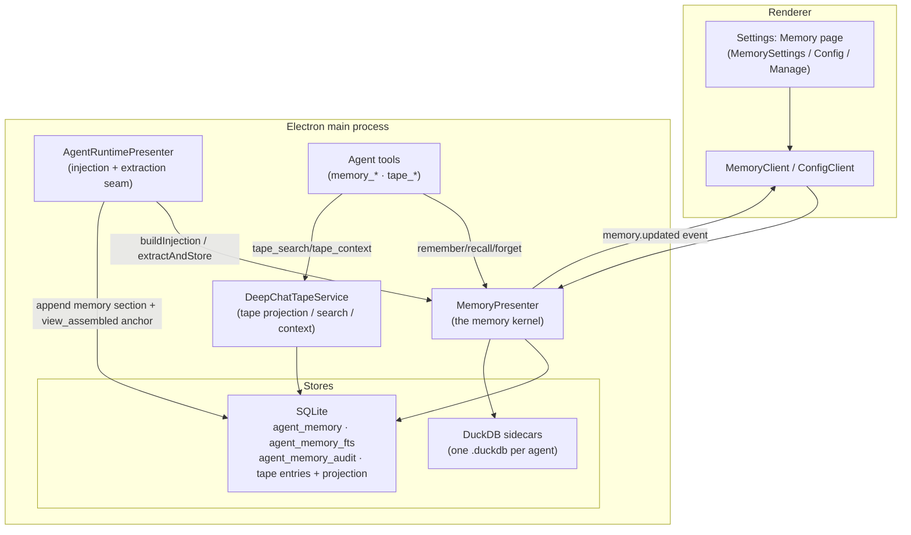
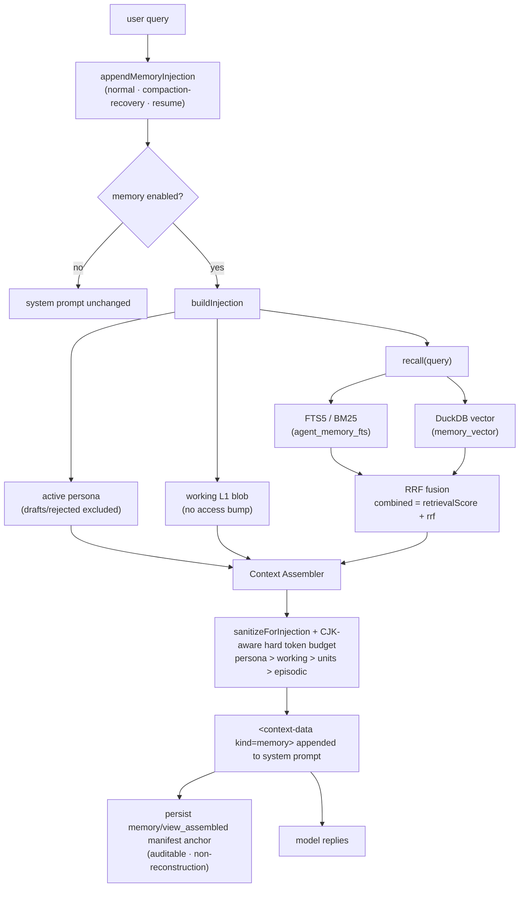
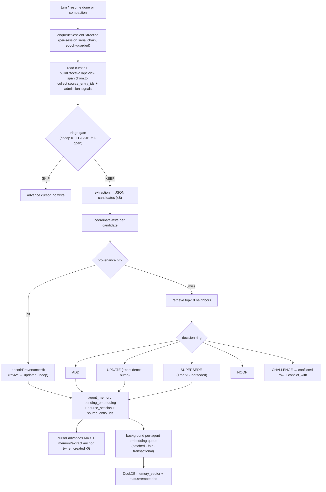
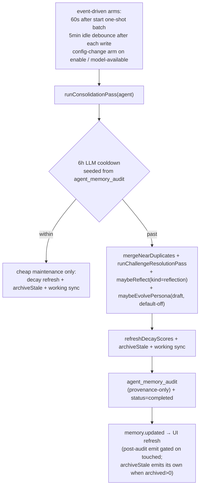
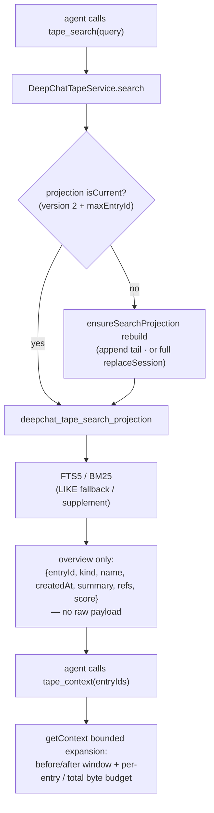

# Agent Memory System — Architecture & Design

## 1. Overview

DeepChat's current memory implementation is a per-agent long-term memory layer built around the tape. It
derives durable memory from the effective tape, keeps lineage back to source entries, and treats the raw tape
as the evidence source of truth. `agent_memory` is the synthesized cache used for recall, update, forgetting,
and audit.

Each agent owns its own memory rows, audit rows, config, and DuckDB vector sidecar. The implementation adds no
new infrastructure and reuses SQLite, DuckDB, the existing embedding manager, the tape effective view, and the
scoring helpers. `Crystal` and `Episodic` session-summary layers remain reserved placeholders, not active read
or write paths.

---

## 2. Design principles

These hold across every module and are the system's core invariants.

1. **Sidecar, one-directional.** Memory consumes the tape effective view and writes only `memory/*` and
   `persona/*` tape anchors that are **non-reconstruction**: they never move the summary cursor, never
   participate in context rebuild, and never write back the original facts.
2. **Never block the turn.** Recall is fail-open: any error returns the original system prompt unchanged.
   Extraction is fail-safe: a failure leaves the extraction cursor unadvanced so the span is retried, and
   never throws into the conversation.
3. **Fail-open where losing data is the risk; fail-closed where writing wrong/stale data is the risk.**
   - Fail-open: triage failure → extract anyway; decision-model failure → degrade to `ADD`; neighbor
     recall failure → proceed with no neighbors; transient embedding-service failure → re-mark
     `pending_embedding` for retry (never terminal `error`).
   - Fail-closed: a vector sidecar whose embedding identity (provider/model/dim) cannot be verified is
     disabled and recall serves FTS only — it never silently returns vectors from the wrong model.
4. **Never hard-delete on the durable path.** Contradiction and staleness use supersede chains and
   soft archival. Only an explicit user UI delete/clear or agent-deletion cleanup hard-deletes.
5. **Hot path adds zero synchronous LLM calls.** Extraction, embedding, reflection, persona evolution,
   merging, and decay all run off the hot path; the only model call near a turn is the optional triage
   gate, and even that runs inside the background extraction chain, not in the send path.
6. **Expensive work is offline.** Consolidation/merge/reflection/persona run on a self-scheduled
   sleep-time pass gated by a restart-durable cooldown and an LLM budget.
7. **Auditable, content-free observability.** Maintenance and user audit rows record *provenance
   metadata only* (ids/action/model, with an optional `session_id` — never raw text) in an audit table;
   injection manifests are persisted as tape anchors.

---

## 3. System overview



**Ownership rules**

- The renderer settings UI talks to the kernel only through typed IPC (`MemoryClient` for management,
  `ConfigClient` for config).
- `AgentRuntimePresenter` owns the *seam*: it decides when to inject and when to extract, and it owns the
  per-session extraction queue and the monotonic cursor. It does not own memory logic.
- `MemoryPresenter` is the single kernel: write decisions, recall, scheduling, lifecycle, persona,
  conflicts. It is the only writer of `agent_memory` / DuckDB.
- `DeepChatTapeService` owns the searchable tape projection (the log-as-memory read model).

---

## 4. Module layout

| Layer | File | Responsibility |
| --- | --- | --- |
| Kernel | `src/main/presenter/memoryPresenter/index.ts` | `MemoryPresenter` — write coordinator, hybrid recall, injection, two-phase embedding, self-scheduling, persona, conflicts, lifecycle/teardown |
| Kernel | `memoryPresenter/decision.ts` | The Mem0-style decision ring prompt + tolerant parser (`ADD/UPDATE/SUPERSEDE/NOOP/CHALLENGE`) |
| Kernel | `memoryPresenter/extraction.ts` | Triage + extraction prompts and parsers; reflection/persona prompts; persona small-step (Levenshtein) guard |
| Kernel | `memoryPresenter/injectionPort.ts` | `sanitizeForInjection` + the token-budgeted Context Assembler + the injection manifest |
| Kernel | `memoryPresenter/scoring.ts` | Recall `retrievalScore`, `decayScore`, RRF `fuse()`, provenance keys |
| Kernel | `memoryPresenter/memoryVectorStore.ts` | `MemoryVectorStore` — per-agent DuckDB sidecar (HNSW/cosine, identity gate, transactional upsert, disk reclaim) |
| Kernel | `memoryPresenter/types.ts` | Ports, DTO/enum types, and the retrieval/scoring/decay tunable constants (injection-budget constants live in `injectionPort.ts`; `WORKING_BLOB_TOKEN_LIMIT` in `index.ts`) |
| Shared | `shared/types/agent-memory.ts` | `AgentMemoryCategory`, `AGENT_MEMORY_CATEGORIES`, and deterministic category importance floors |
| Storage | `sqlitePresenter/tables/agentMemory.ts` | `agent_memory` table + `agent_memory_fts` FTS5 + keyword search |
| Storage | `sqlitePresenter/tables/agentMemoryAudit.ts` | `agent_memory_audit` content-free maintenance ledger |
| Storage | `sqlitePresenter/tables/deepchatTapeSearchProjection.ts` | `deepchat_tape_search_projection` (+ meta + FTS) evidence projection |
| Runtime seam | `agentRuntimePresenter/index.ts` | `appendMemoryInjection`, `enqueueSessionExtraction`, span builder, cursor, memory anchors |
| Runtime | `agentRuntimePresenter/tapeService.ts` | `search()` / `getContext()` / `ensureSearchProjection()` |
| Tools | `toolPresenter/agentTools/agentMemoryTools.ts` | `memory_remember` / `memory_recall` / `memory_forget` |
| Tools | `toolPresenter/agentTools/agentTapeTools.ts` | `tape_info` / `tape_search` / `tape_context` / `tape_anchors` / `tape_handoff` |
| Skills | `resources/skills/memory-management/SKILL.md` | Discoverable guidance for recall/remember discipline and Memory vs Skill vs Scheduled Task routing |
| Contracts | `shared/contracts/routes/memory.routes.ts` | All `memory.*` IPC routes + DTO schemas |
| Contracts | `shared/contracts/events/memory.events.ts` | `memory.updated` event + reason enum |
| Renderer | `renderer/settings/components/Memory*.vue`, `renderer/api/MemoryClient.ts` | The settings IA (page, config tab, manage tab) |

---

## 5. Data model and storage responsibilities

Memory is split across five stores. Each has one job; none is authoritative for more than its job.

| Store | Holds | Rebuildable? |
| --- | --- | --- |
| SQLite `agent_memory` | Authoritative memory rows: content, kind, optional agentic category, status, importance, confidence, decay, lineage (`source_entry_ids`), supersede chain, persona state, conflict link | No — source of truth for synthesized memory |
| SQLite `agent_memory_fts` | Keyword recall (BM25), external-content mirror of `agent_memory` | Yes — rebuilt idempotently; degrades to `LIKE` |
| SQLite `agent_memory_audit` | Maintenance/user provenance ledger (ids/action/model; `scheduler`/`user` actors + optional `session_id`; drives the cooldown) | No — but content-free |
| SQLite `deepchat_tape_search_projection` | Searchable evidence projection of the effective tape (summary + refs + FTS) | Yes — rebuilt from raw tape entries |
| DuckDB sidecar (one `.duckdb` per agent) | `memory_vector` (HNSW/cosine) + `embedding_meta` (provider/model/dim identity) | Yes — re-embedded from `agent_memory` |

The raw tape (`deepchat_tape_entries`) remains the ultimate evidence source of truth and also stores the
`memory/extract` and `memory/view_assembled` audit anchors (both non-reconstruction).

### 6.1 `agent_memory` columns

`id`, `agent_id`, `user_scope`, `kind`, `category`, `content`, `importance`, `status`, `embedding_id`,
`embedding_dim`, `embedding_model`, `source_session`, `provenance_key`, `is_anchor`, `superseded_by`,
`created_at`, `last_accessed`, `access_count`, `decay_score`, `source_entry_ids`, `confidence`,
`last_consolidated_at`, `conflict_state`, `conflict_with`, `persona_state`.

A unique partial index on `(agent_id, provenance_key)` enforces idempotent dedup.

### 6.2 Enums

| Enum | Members | Notes |
| --- | --- | --- |
| `AgentMemoryKind` | `episodic`, `semantic`, `reflection`, `persona`, `working` | `working` is an internal single-blob session-open cache (never recalled/embedded/archived). `crystal` is reserved (no read/write path). |
| `AgentMemoryCategory` | `user_preference`, `project_fact`, `task_outcome`, `heuristic`, `anti_pattern` | Optional agentic write contract. `task_outcome` normalizes to `episodic`; the other categories normalize to `semantic`. `reflection`/`persona`/`working` rows always carry `NULL`. |
| `AgentMemoryStatus` | `pending_embedding`, `embedded`, `error`, `fts_only`, `archived`, `conflicted` | `fts_only` = recallable by keyword but not vector (no embedding config / transient). `archived` = soft-deleted. `conflicted` = a `CHALLENGE` row. |
| `AgentMemoryPersonaState` | `draft`, `active`, `superseded`, `rejected` | Only meaningful for `kind='persona'`; `NULL` for everything else. Legacy persona rows are read as active while not superseded. |
| `AgentMemoryConflictState` | `challenged` | Marks the *target* of an open challenge. |

### 6.3 Lineage contract

`source_entry_ids` stores **tape `entry_id` integers** (a JSON array), scoped by `source_session`. It is
dropped when there is no source session, and never stores message ids. It is collected in the same pass
that builds the extraction span (a message contributing no text appears in neither the span nor the
lineage).

---

## 6. The read path

Recall runs before each send and adds a read-only memory section to the system prompt. All three runtime
entry points — normal send, context-pressure compaction recovery, and resume — funnel through one
`appendMemoryInjection` seam so injection is identical across paths; a disabled agent short-circuits and
the system prompt is returned byte-for-byte unchanged.



**`buildInjection` details**

- Reads the **active** persona only (`getActivePersona`); drafts and rejected versions are never injected.
- Reads the working-memory blob without bumping `access_count`; on a cold start it schedules an off-hot-path
  working refresh.
- Resolves recalled units via `retrieve(query, recordAccessHits=true)` — directly for a non-empty query, or
  via `recall()` (which delegates to `retrieve` with `recordAccessHits=true` and short-circuits to `[]` on an
  empty query); returns `null` if persona, working, and recall are all empty.
- Produces a `MemoryInjectionPayload` (selfModel + working + memories + `tokenBudget`) and a manifest
  (selected/dropped/queryHash). The runtime appends the section and persists a `memory/view_assembled`
  anchor.

**Sanitization (`sanitizeForInjection`).** Persona and recalled bodies are neutralized before injection by
inserting a zero-width character into instruction-like markers: line-leading `#`, code fences (```` ``` ````),
role prefixes (`system:`/`assistant:`/`user:`), and literal `<context-data` tags. The whole block is wrapped
in a read-only `<context-data kind="memory">` container preceded by a `READONLY_NOTICE` telling the model to
treat it strictly as data. This is the persistent prompt-injection mitigation.

**Context Assembler (token budget).** Admission priority is `persona > working > recalled units > episodic`,
but priority only decides order — the resolved budget (default **1200** tokens; configured values are clamped
down to a max of **8000**, and a value below **64** or malformed falls back to the 1200 default) is a hard
ceiling every section counts against. `estimateTokens` is CJK-aware (CJK/Kana/Hangul characters counted
at density **1.5**, other characters at `1/4`) so Chinese sections are not over-admitted. Persona and working
are placed first with a floor reservation so neither starves the other; recalled memories are admitted
whole-line (never half a sentence); episodic summaries sit last so they are cut first. The assembler is the
final boundary and never trusts an upstream size cap.

---

## 7. The write path

Extraction is triggered after a turn/resume completes or on compaction, serialized per session, and never
on the hot path. It builds its span from the **effective** tape view (after retract/replace/tool-dedup),
not from raw messages. The span carries only user-visible text: a user entry contributes its message text and
an assistant entry contributes only its `content` blocks — assistant reasoning (`reasoning_content` /
`reasoning` blocks) is deliberately excluded so internal chain-of-thought never becomes a durable memory. The
raw tape still records reasoning in full; only the extraction input drops it (a message contributing no
visible text appears in neither the span nor the lineage).

Fallback extraction is task-aware. The span builder computes `hadToolUse` and `visibleTextChars` in the same
effective-view pass that collects text and lineage. `hadToolUse` is derived by matching effective `tool_call`
rows' `payload.messageId` against the selected message window; raw tape rows are not filtered by `orderSeq`.
A fallback span is admitted only when it has visible text and either used a tool, reaches the long-span
backstop (`delta >= 6`), or is a short but substantive text span (`delta >= 2` and at least 160 visible
characters). Empty visible-text spans return before extraction and do **not** advance the memory cursor.
Compaction-triggered extraction keeps its old behavior.



**Triage gate.** A cheap `KEEP/SKIP` pass runs before full extraction over the span's last 4000 chars. The
KEEP criteria include stable user preferences, project facts, durable task outcomes, heuristics,
anti-patterns, constraints, and notable decisions. It is doubly fail-open: `parseTriageDecision` skips only on
an explicit `SKIP` without `KEEP`, and a thrown triage call is caught and extraction proceeds anyway. A SKIP
still advances the cursor (the span is consumed).

**Extraction.** Over the span's last 12000 chars, the model returns at most **8** raw candidates (enforced
both in the prompt and as a hard parse cap), each `{category, content, importance}`. Parsing is tolerant
**per entry** — a malformed individual entry or empty content is skipped, raw `category`/legacy `kind` are
preserved, malformed importance is left for normalization, and each span keeps at most one `task_outcome`.
A **top-level** parse failure (empty response, no JSON array, invalid JSON, or a non-array), however, is
reported as a discriminated `MemoryCandidateParseResult` (`{ ok: false, reason }`) rather than silently
degraded to `[]`, so the caller can retry the span instead of consuming it; a successful parse returns
`{ ok: true, candidates }` (an empty array is a valid success).

**Candidate normalization.** Every write entry point (`coordinateWrite`, `directAddMemory`, and
`writeMemoriesSync`) normalizes candidates before provenance-key generation or storage. A valid category
takes precedence over legacy `kind`: `task_outcome` becomes `episodic`, all other valid categories become
`semantic`; a missing category may keep a valid legacy `episodic`/`semantic` kind with `category=NULL`;
an invalid category becomes `semantic` + `NULL`. Importance is clamped/defaulted and then raised to
`CATEGORY_IMPORTANCE_FLOOR[category]` when a category is present. `reflection`, `persona`, and `working` rows
are never allowed to carry a category.

**The extraction model is not a hardcoded "small" model.** Two resolvers exist. `resolveExtractionModel` uses
the agent's configured `memoryExtractionModel` when set; the extraction/triage/decision path falls back to the
**active chat model**. The offline passes use a separate `resolveConsolidationModel` whose fallback is the
agent's **default model** (`resolveAgentDefaultModel`), not the active chat model — consolidation, reflection,
and persona run on the scheduler with no active chat session, so the active chat model is structurally
unavailable to them. The cost saving comes from the triage gate avoiding the larger extraction call, plus the
*option* to point extraction at a cheaper model.

**Decision ring (`coordinateWrite`).** Each candidate:

1. Trim; empty → no-op. Teardown guard → no-op.
2. Compute the provenance key and check for an existing row. A hit calls `absorbProvenanceHit`: if it
   revived an archived/superseded row it returns `updated`, else `noop(duplicate)`.
3. Otherwise retrieve up to **10** neighbors and run the decision model (`buildDecisionPrompt` →
   `parseDecision`). Any decision-model failure or out-of-range target index degrades to `ADD` so a
   hallucinated index can never touch the wrong row.
4. Apply: `ADD` inserts with the candidate category; `UPDATE` rewrites the target content + bumps confidence
   + re-queues embedding and only absorbs the candidate category when the target category is `NULL`;
   `SUPERSEDE` inserts the merged row with the candidate category and supersedes the target; `NOOP` does
   nothing; `CHALLENGE` inserts a `conflicted` row linked via `conflict_with` and marks the target
   `challenged`.

The write outcome is a discriminated union `MemoryWriteOutcome` (`created` / `updated` / `superseded` /
`noop` / `challenged`). The same coordinator backs both extraction and the agent-facing `memory_remember`
tool and the user-facing `memory.add` route (when an extraction model is configured; otherwise the user-add
path is a pure dedupe-add).

**Two-phase persistence.** Phase 1 is a synchronous SQLite insert as `pending_embedding`. Phase 2 is an
asynchronous, per-agent, fair, batched embedding drain: `listPendingEmbedding` filters by `agent_id` in SQL
(no cross-agent starvation), one batched `getEmbeddings` call, and a single transactional upsert into DuckDB
under the per-agent lock. A transient embedding-service failure re-marks rows `pending_embedding` (self-heals,
never terminal); a dimension mismatch marks the row `error`; a vector-store write failure after a successful
embed is terminal `error`.

**Cursor.** `memory_cursor_order_seq` (on `deepchat_sessions`) is written `SET = MAX(existing, floor(x), 0)`,
so a late/stale extraction can never roll it back. It advances only when `extractAndStore` returns `ok: true`
— i.e. the model output parsed into a (possibly empty) candidate array; a transient LLM error or a top-level
parse failure returns `ok: false` and leaves the cursor for retry, so a span is never consumed by an output
the model could not understand. A `memory/extract` anchor is written only when at least one row was created.

---

## 8. Retrieval and scoring

`retrieve()` resolves the per-agent retrieval config, fetches `topK*2` candidates from each path, fuses them,
and trims to `topK`.

- **Keyword path.** `agent_memory_fts` (FTS5, BM25-ranked) with the tokenizer chosen at runtime — `trigram`
  for CJK/substring matching, else `unicode61`. The query is tokenized on whitespace; each term is quoted
  independently (so user text can never inject an FTS5 operator) and the terms are joined with `AND`, so a
  multi-word query matches rows containing **all** terms in any order rather than only an exact phrase (a
  single-term query is unchanged). `LIKE` runs the same per-term `AND` and is unioned in, so the result is
  never a subset of the legacy `LIKE` behavior; if FTS5 is unavailable the path is pure `LIKE`. Persona,
  working, archived, conflicted, and superseded rows are excluded. The FTS index records its tokenizer and
  version in `agent_memory_fts_meta`; if the runtime tokenizer choice changes (e.g. content starts containing
  CJK), the index is dropped and rebuilt so a stale tokenizer can never silently degrade keyword recall.
- **Vector path.** Only when an embedding model is configured. The query is embedded, DuckDB returns nearest
  neighbors by cosine distance, distances are converted to similarity and filtered by `similarityThreshold`,
  and the same row-class exclusions as the keyword path (persona, working, archived, conflicted, superseded)
  are applied to the matches. If any embedded row's identity is stale (model/dim/fingerprint mismatch), the
  turn answers **FTS-only** and a non-destructive background re-embed is queued — rows are never deleted.

**RRF fusion (`fuse`).** Each path contributes `1/(rrfK + rank + 1)` per item, accumulated when a memory
appears in both lists. The final order is:

```text
combined = retrievalScore + RRF
```

`retrievalScore` (which carries the real vector similarity, vs. an FTS baseline of `0.3` for keyword-only
hits) is the dominant term, so a strong vector hit is never overtaken by a weak keyword-only hit. RRF is only
an additive boost that lifts dual-path evidence above equally-scored single-path hits. Sorting is by
`combined`, tie-broken by `retrievalScore`.

**`retrievalScore` (recall ranking).**

```text
recency        = 0.5 ^ (age / halfLifeForKind)        # semantic 14d · episodic 30d · reflection 60d
base           = w.sim·similarity + w.rec·recency + w.imp·importance
confidenceFactor = max(0, 1 + 0.5·(confidence − 0.7))  # default confidence 0.7
floor          = 0.15 · importance
retrievalScore = max(base · confidenceFactor, floor)   # important-but-decayed memories keep a floor
```

Defaults: `topK=6`, `rrfK=60`, `similarityThreshold=0.2`, weights `{similarity 0.6, recency 0.25,
importance 0.15}`. Malformed config clamps to defaults (`topK ≤ 100`, `rrfK ≤ 1000`).

**`decayScore` (forgetting, separate from recall).**

```text
anchor       = last_accessed ?? created_at
decayScore   = 0.5 ^ ( (now − anchor) / (30d · (1 + clamp01(importance))) )
```

Important memories stretch their half-life, so they survive longer before becoming archive-eligible. Recall
and forgetting are deliberately two different scores: a memory can rank low for recall yet still be retained.
`category` is not a second scoring axis: it is ignored by retrieval, decay, RRF, and rerank logic. Its only
ranking/retention effect is indirect, through the deterministic importance floor applied at write time.

---

## 9. Consolidation, forgetting, and offline scheduling

Memory schedules its **own** maintenance — it does not rely on the repo-wide scheduled-tasks service.



**Event-driven arms, one pass.** A per-agent **5-minute idle debounce** is armed on every mutating write.
After app start, a one-shot 60-second startup timer lists agents with active memories, filters them through
`shouldArmMaintenance` (safe id · managed agent · memory enabled), sorts them, and schedules deterministic
5-second-staggered idle timers. Maintenance-relevant DeepChat config writes also arm eligible agents:
`memoryEnabled`, `memoryExtractionModel`, `assistantModel`, and `defaultModelPreset` trigger the arm because
they affect enablement or consolidation model resolution. Custom-agent changes arm that agent, while builtin
changes fan out to active inheritors with the same deterministic stagger. Renderer update saves send diff-only
config patches, so unchanged model keys do not reach this field-presence gate. Every arm funnels into
`runConsolidationPass`, which then enforces the cooldown.

**Restart-durable cooldown.** The LLM-backed work runs at most once per **6 hours** per agent. The watermark
is seeded from the audit table (`getLatestCompletedEventAt('memory/maintenance_llm')`) when the in-memory
value is absent, so the cooldown survives restarts. Within the cooldown only cheap local upkeep runs (no LLM,
no audit row). A missing-model pass is recorded `skipped` and does **not** advance the cooldown (it retries
next trigger).

**`mergeNearDuplicates` (budgeted).** Iterates active non-persona rows oldest-first, bounded by **8 LLM
calls** and **24k input tokens** per pass (remainder deferred). For each row it picks the first neighbor with
similarity ≥ **0.85** and runs the same decision prompt; only `UPDATE`/`SUPERSEDE` fold the pair (the
more-recent row normally survives — unless the merged content's provenance key is already owned by a third
row, in which case the pair folds into that owner; importance and confidence only ever rise), so a re-run
converges.

**Non-destructive archival (`archiveStale`).** A row is soft-deleted only when **all** of: `decayScore <
0.05`, `access_count == 0`, age `> 90 days`, still active. Anchors and persona are exempt. `restoreMemory`
reverses it. There is no hard delete on this path.

---

## 10. Cognitive layers

The store is layered rather than a flat bag of facts.

- **Units** — `episodic` and `semantic` atomic memories from extraction.
- **Reflection** — `maybeReflect` distills high-level insights (`kind='reflection'`) from recent atomic
  memories. It is the load-bearing change that removes silent persona drift: reflection now runs **only from
  the offline pass**, gated on accumulated importance (≥ `5.0`) since the last reflection, with ≥ 3 source
  memories and up to 20 inputs. Reflections decay slowest (60-day half-life).
- **Working memory (L1)** — a single `kind='working'` blob per agent (≤ **400 tokens**), refreshed off the
  hot path, read at session open without an access bump, and excluded from recall / FTS / embedding /
  consolidation. It is injected as its own section ahead of recalled memories.
- **Context Assembler** — see §6; priority `persona > working > units > episodic` under a hard CJK-aware
  budget, emitting a selected/dropped manifest.

`Episodic` session-summary and `Crystal` layers are intentionally deferred (placeholders only).

---

## 11. Guarded persona evolution

Automatic self-model evolution is an **opt-in, default-off, approvable** experiment — it must never drift
silently or inject unapproved text.

- **Two gates.** Requires both `memoryEnabled` and `personaEvolutionEnabled` (independent, default off). When
  off, reflection still runs but no persona draft is produced.
- **Draft → approval.** `maybeEvolvePersona` (offline only, under a per-agent persona lock) produces at most
  one outstanding `persona_state='draft'`, gated on ≥ 3 memories and accumulated importance ≥ `5.0`. A draft
  is **never injected**. The user approves / rejects / rolls back / anchors via IPC routes.
- **Small-step constraint.** A draft whose normalized Levenshtein change ratio vs. the active self-model
  exceeds `0.6` is flagged `needsReview` and kept out of any auto-approval path.
- **Real `is_anchor` guard.** Once a version is anchored, `rollbackPersona` refuses to overwrite it; rollback
  only re-activates historical (superseded) versions. This settles the previously-inert `is_anchor` field.

---

## 12. Execution-memory query

`agent_memory` is a synthesis cache; the **raw tape is the evidence source of truth**. The execution log is
made directly queryable to the agent via a searchable projection plus two tools.



- **Projection.** `deepchat_tape_search_projection` denormalizes the effective tape into searchable rows:
  `search_text`, a per-entry `summary` (≤ 1200 chars), and structured `refs` (filePaths, commands,
  errorCodes, exitCode, ids). It carries its own content version (`PROJECTION_VERSION = 2`) and a
  per-session watermark; `isCurrent` short-circuits when the version and `maxEntryId` match, otherwise it
  rebuilds — incrementally (append the new tail) when prior entries are an exact prefix, else a full replace.
  An independent FTS watermark lets the FTS index lag and self-heal lazily at query time.
- **`tape_search`** returns an **overview with no payload** (forcing `tape_context` for actual content),
  BM25-ranked with a `LIKE` fallback/supplement.
- **`tape_context`** expands specific entry ids with a bounded window (before/after default 2, clamp ≤ 20),
  an entry cap (default 50), and byte budgets (per-entry default 2048 / max 8192; total default 16384 / max
  65536), UTF-8-safe truncated. Tape tools are DeepChat-agent-only and `tape_context` is advertised only when
  the tool-runtime port exposes `getTapeContext` (wired to `AgentSessionPresenter`, not the memory kernel; in
  practice always present).
- The whole projection/search layer is fail-open: any error degrades to a coarser search over the effective
  tape rather than throwing (the one exception is an unparseable time boundary, which is reported).

---

## 13. Lifecycle and correctness

This is where the "stabilization" and "kernel hardening" work concentrates.

- **Per-agent serialization.** Every open/close/reset of the single per-agent `.duckdb` file goes through
  `runExclusiveForAgent`, guaranteeing the file is never opened by two `DuckDBInstance`s at once. The
  embedding drain deliberately runs *outside* this lock (it spans a network call); persona ops use a separate
  per-agent persona lock.
- **Vector identity gate.** On opening an existing sidecar, `embedding_meta` (provider/model/dim) is compared
  against the current request. A mismatch or a legacy sidecar with no identity → the store is marked unusable
  and recall serves FTS only, with an explicit warning. A model/dimension switch closes the old instance and
  recreates the file. The dimension is baked into the DuckDB column type, so a dimension change requires a
  full file reset (`destroyFile` + recreate), not an in-place migration.
- **Transactional vector upsert.** `upsert` wraps delete-then-insert in `BEGIN/COMMIT` with `ROLLBACK` on
  error, so there is no "deleted-but-not-inserted" hole.
- **Archive / forget / restore lifecycle.** Agent-facing `forgetMemory` is a soft archive: it marks the row
  `archived`, leaves any existing vector in place, and relies on recall's status filters plus SQLite
  re-checks to keep archived facts out of results. It only requires a managed agent, so users can forget
  while memory is disabled. `restoreMemory` re-marks the row `pending_embedding` and re-embeds it, and remains
  gated by `canWriteAgentMemory` (managed agent · memory enabled · not disposed). Permanent UI delete
  (`deleteMemory`) hard-deletes the row and best-effort deletes its vector.
- **Embedding-drain config guard.** A background embedding drain captures the embedding identity it started
  with; before writing vectors, and before a reindex reset, it re-checks the agent's current `memoryEmbedding`
  fingerprint and discards the batch if the config changed mid-flight, so a stale drain can never write
  vectors from a superseded model into a freshly reset sidecar.
- **Provenance revival (`absorbProvenanceHit`).** When an archived/superseded fact is re-asserted, it is
  revived and the contradicting supersede lineage is retired back into it so the revived row becomes current
  truth (cycle- and cross-agent-guarded). `applyContentUpdate` keeps a row's `provenance_key` aligned with
  its new content so dedup never breaks: if the new key is unowned it rewrites content + key in place; if the
  key is already owned by a different row it folds this row into that owner instead (reviving the owner via
  `absorbProvenanceHit`, then `markSuperseded(row, owner)`) and returns the owner's id.
- **Close-safe teardown (`dispose`).** A `disposed` flag is set first so any already-fired timer's pass
  becomes a no-op; `canWriteAgentMemory` / `canReadAgentMemory` both include `!disposed` and are re-checked
  after every `await`. Dispose stops the startup maintenance timer, clears per-agent idle timers,
  bounded-drains in-flight consolidation / reindex / backfill / embedding writers, awaits per-agent locks,
  and closes every DuckDB store — before the SQLite connection closes. (The fire-and-forget extraction chain
  is not drained by `dispose`; it self-guards on `disposed`.)
- **Agent-deletion cleanup.** Deleting a DeepChat agent atomically clears `agent_memory` +
  `agent_memory_audit` in one SQLite transaction, then best-effort destroys that agent's DuckDB sidecar file.
- **Disk reclaim.** A per-row hard delete does not shrink the DuckDB file; only a whole-store reset
  (`clearMemories` / agent delete) calls `destroyFile` to actually reclaim (there is no `VACUUM`), so the file
  grows between resets.

---

## 14. Contracts

### 15.1 Agent-facing tools

| Server | Tool | Behavior |
| --- | --- | --- |
| `agent-memory` | `memory_remember` | Persist a durable fact/event with optional category; routes through the decision ring (`coordinateWrite`). |
| `agent-memory` | `memory_recall` | Recall relevant memories for a query (ranking/limit are kernel-side). |
| `agent-memory` | `memory_forget` | **Archive** (soft delete) a memory by id so it is no longer recalled. |
| `agent-tape` | `tape_info` / `tape_anchors` / `tape_handoff` | Tape introspection and subagent handoff. |
| `agent-tape` | `tape_search` | Overview-only search of the tape projection (no payload). |
| `agent-tape` | `tape_context` | Bounded evidence expansion of specific entry ids. |

Tool results are success-enveloped even for "soft" outcomes (memory disabled, `noop`, not-found) — callers
inspect `result.ok`, not `isError`. Hard infra failures throw.

### 15.2 IPC routes (`memory.*`)

`memory.list`, `memory.getStatus`, `memory.search`, `memory.add`, `memory.delete`, `memory.clear`,
`memory.restore`, `memory.getSourceSpan`, `memory.listConflicts`, `memory.resolveConflict`,
`memory.listPersonaVersions`, `memory.rollbackPersona`, `memory.listPersonaDrafts`,
`memory.approvePersonaDraft`, `memory.rejectPersonaDraft`, `memory.setPersonaAnchor`,
`memory.listAuditEvents`, `memory.listViewManifests`.

- `memory.search` is read-only: it caps the result count but cannot widen the agent's configured `topK`, and
  does not bump `access_count`.
- `memory.add` accepts optional `category`, runs the decision ring, and writes a `memory/add` user audit row.
- `memory.getSourceSpan` resolves a memory's `source_entry_ids` to readable role/content via the effective
  tape view (powers the lineage UI).
- `MemoryItemSchema` carries `category`, `sourceEntryIds`, `conflictWith`, `personaState`, `isAnchor`,
  `needsReview`; the status enum includes `conflicted`/`archived`/`fts_only`.

### 15.3 Events

`memory.updated` is the only event. Its `reason` is one of `extract`, `delete`, `clear`, `persona-evolve`,
`persona-draft`, `persona-approve`, `persona-reject`, `persona-rollback`, `reindex`. The payload carries
`{agentId, reason, version}` and **never** any memory content.

### 15.4 Audit ledger (`agent_memory_audit`)

Background maintenance and user writes record `memory/maintenance_llm`, `memory/reflect`, `persona/evolve`,
`memory/challenge_resolved`, and `memory/add` — with `actorType` (writes use `scheduler` or `user`; `runtime`
is accepted by the schema/filter but no current write path emits it), an optional `session_id`, a terminal
`status` (`completed`/`skipped`/`failed`), and `inputRefs`/`outputRefs` that contain only ids, action
strings, counts, ratios, and booleans. No raw memory text or persona content is ever stored.

---

## 15. Settings surface

Memory is a first-class, top-level settings section, configured strictly per-agent.

- **IA.** A top-level `settings-memory` page (`/memory`, group `knowledge`) with an in-page agent picker
  (default builtin `deepchat`) and bidirectional `?agentId=` URL sync. Two tabs: **Config** and **Manage**.
- **Config tab** exposes config the kernel already supported but the UI didn't: `memoryEmbedding`,
  `memoryExtractionModel`, `memoryInjectionTokenBudget`, `memoryRetrieval` (`topK`/`rrfK`/
  `similarityThreshold`/`weights`), and `personaEvolutionEnabled`. Its DEFAULTS and LIMITS mirror the kernel
  constants exactly (topK 6 / rrfK 60 / threshold 0.2 / budget 1200; ranges topK 1–100, rrfK 1–1000, budget
  64–8000).
- **Manage tab** reuses `MemoryManagerPanel` (Memories / Persona / Activity) and is the only surface that
  uses `MemoryClient`. Memory rows show a category badge and the Memories list has a local category filter;
  `NULL` / missing categories are displayed and filtered as `uncategorized`. The manual add form exposes
  `kind` and importance but not category.
- **Inheritance.** Per-agent config inherits the builtin `deepchat` root then applies its own overrides
  (`override ?? base ?? default`). Clearing an override writes an **explicit `null`** (so an inherited value
  is never ossified onto a child agent); untouched booleans are omitted from the patch. The agent editor
  keeps only an "enable memory" toggle + a deep-link to this page.

---

## 16. Schema and migrations

A single global schema version is shared across all SQLite tables (the migration runner takes the max of
every table's latest version). The memory work advanced it from 31 to **37**.

| Table | Change | Migration |
| --- | --- | --- |
| `agent_memory` | v32 backfills `embedding_model` + `source_entry_ids`; v33 adds `confidence` + `last_consolidated_at` + `conflict_state`; v34 adds `persona_state`; v35 adds `conflict_with`; v37 adds nullable `category`. `getCreateTableSQL` is authoritative (new DB == migrated old DB). `schemaCatalog.agent_memory.repairableColumns` can repair a missing `category` column. **Purely additive.** | Yes (`getMigrationSQL`) |
| `agent_memory_fts` | FTS5 external-content virtual table + `ai`/`ad`/`au` triggers; tokenizer probed at runtime | No — built idempotently |
| `agent_memory_audit` | New table at v36: maintenance/user provenance ledger (`scheduler`/`user` actors + optional `session_id`), ids/metadata only | Yes (whole table) |
| `deepchat_tape_search_projection` (+ meta + FTS meta) | Searchable projection of the effective tape + FTS5 (content `PROJECTION_VERSION=2`) | No — version-exempt, rebuilt idempotently from raw tape |
| `deepchat_sessions` | `memory_cursor_order_seq` now written monotonically (`MAX(...)`) | — |
| DuckDB (per agent) | `memory_vector` (HNSW/cosine, `M=16`, `ef_construction=200`) + `embedding_meta` (identity; mismatch → fail-closed to FTS) | No — built at runtime |

Migration statement errors for additive idempotent ops (duplicate `ADD COLUMN`, index already exists) are
selectively ignored, so the v32 backfill is safe against DBs that already have the columns.

---

## 17. End-to-end flow

```text
enable memory (top-level Memory page / agent toggle)
→ appendMemoryInjection (unified across normal / compaction-recovery / resume)
→ buildInjection: active persona (drafts excluded) + working L1 (no bump) + recall
→ recall = FTS5/BM25 ∪ DuckDB vector → RRF fusion (retrievalScore dominant; FTS-only + bg reindex on dim change)
→ Context Assembler: sanitize + CJK-aware hard token budget (persona > working > units > episodic)
→ <context-data kind="memory"> appended; persist memory/view_assembled manifest anchor
→ model replies
→ turn/resume/compaction → enqueueSessionExtraction (per-session serial, epoch-guarded)
→ cursor + effective-view span + source_entry_ids lineage + admission signals
→ fallback admission (visible text + tool/backstop/substantive text) or compaction
→ triage gate → extraction raw category candidates → normalization → decision ring
  (ADD/UPDATE/SUPERSEDE/NOOP/CHALLENGE, with revival)
→ SQLite pending_embedding → cursor advances MAX + memory/extract anchor
→ background per-agent embedding (batched · fair · transactional) → DuckDB
→ [offline] self-scheduled sleep-time pass (6h cooldown): merge + conflict adjudication
   + reflect(kind=reflection) + persona draft (default-off) + decay refresh + archiveStale + working sync
→ agent_memory_audit (provenance-only) + memory.updated event
```

---

## 18. Testing

Coverage mirrors source under `test/main/**` (and `test/renderer/**` for UI), pinning each invariant:

- Injection sanitization; per-session serial extraction lock; monotonic cursor; insert error
  classification.
- Vector upsert transaction + identity guard (fail-closed to FTS); reindex on dimension change.
- Decision ring (five branches + fallbacks); provenance revival; conflict closure / resolution; category
  propagation and reflection/persona/working category guards.
- Dual-score forgetting / four-condition archival; offline consolidation (cooldown / budget /
  restart-durable / idle debounce); reflection recall; working blob; guarded persona (default-off / draft /
  anchor / eval gate).
- Lineage DTO + source span; tape projection FTS/BM25 + `tape_context`; atomic agent-deletion cleanup.
- Settings surface (override clear / inheritance / clamp; category badge/filter); retrieval eval (hit@3 / MRR /
  nDCG).

The real-DB FTS5/trigram (CJK) eval runs only when native `better-sqlite3` is loadable (force with
`DEEPCHAT_REQUIRE_NATIVE_SQLITE=1`); it is not wired to a CI Action. Run before merge: `pnpm run typecheck`,
`pnpm test`, `pnpm run lint`, `pnpm run format:check`.

---

## 19. Known limitations and risks

- **Triage SKIP is permanent.** A wrongly-SKIPped durable span is consumed and not re-extracted; mitigated by
  the conservative fail-open triage (KEEP unless an explicit SKIP).
- **Category prose can drift.** The category enum/floors have one shared source of truth, but the automatic
  extraction prompt and the `memory-management` skill intentionally carry separate prose for different
  audiences.
- **Manual add category is hidden.** `memory.add` supports category, but the Manage-tab manual add form only
  exposes `kind` and importance; user-added rows default to uncategorized unless another caller supplies
  category.
- **Memory-management skill is opt-in.** The bundled skill is discoverable and has no `allowedTools`, but it
  is not auto-pinned into every conversation to avoid permanent prompt cost.
- **DuckDB disk reclaim.** Per-memory hard delete does not shrink the file; only a whole-store reset reclaims
  (no `VACUUM`), so the file grows between resets. Permanent `deleteMemory` removes the row's vector from the
  cached/opened store under the per-agent lock; `forgetMemory` is a soft archive and may leave an orphan
  vector, which is harmless because recall excludes archived rows and re-checks the authoritative SQLite row.
- **FTS5 native dependency.** Under vitest with an unloadable native ABI, the real FTS5/trigram eval skips;
  CI needs a working native build to exercise it.
- **Vector query threshold.** `MemoryVectorStore.query` does not apply a distance cutoff itself; the
  `similarityThreshold` is enforced presenter-side after distance→similarity conversion.

---

## 20. Appendix — tunable constants

| Constant | Value | Gates |
| --- | --- | --- |
| `DEFAULT_RETRIEVAL.topK` | 6 | recalled candidates returned |
| `DEFAULT_RRF_K` | 60 | RRF rank constant |
| `DEFAULT_SIMILARITY_THRESHOLD` | 0.2 | vector recall cutoff |
| retrieval weights | `{sim 0.6, rec 0.25, imp 0.15}` | `retrievalScore` base |
| `DEFAULT_INJECTION_TOKEN_BUDGET` | 1200 (max-clamp 8000; <64 or invalid → 1200) | Context Assembler hard ceiling |
| CJK token density | 1.5 (others `1/4`) | `estimateTokens` |
| recall half-lives | semantic 14d · episodic 30d · reflection 60d | `recencyScore` |
| `DEFAULT_CONFIDENCE` / boost | 0.7 / 0.5 | recall confidence factor |
| `IMPORTANCE_FLOOR_COEF` | 0.15 | recall floor |
| `FTS_SIMILARITY_BASELINE` | 0.3 | keyword-only hit similarity |
| `FORGET_HALF_LIFE_MS` | 30d (× `1 + importance`) | `decayScore` |
| `CATEGORY_IMPORTANCE_FLOOR` | user_preference 0.5 · project_fact 0.6 · task_outcome 0.55 · heuristic 0.5 · anti_pattern 0.6 | write-time category floor |
| archive thresholds | decay < 0.05 · access = 0 · age > 90d | `archiveStale` |
| `DECISION_NEIGHBOR_TOP_S` | 10 | neighbors fed to the decision model |
| `MAX_CANDIDATES` | 8 | extraction candidates per span |
| triage / extraction span | last 4000 / 12000 chars | prompt truncation (tail) |
| `MEMORY_FALLBACK_MIN_DELTA` | 6 | min orderSeq delta before fallback extraction |
| `MEMORY_MIN_AGENTIC_TEXT_CHARS` | 160 | short non-tool fallback text threshold |
| `CONSOLIDATION_IDLE_MS` | 5min | idle debounce after a write |
| `MAINTENANCE_START_DELAY_MS` / `STARTUP_ARM_STAGGER_MS` | 60s / 5s | one-shot startup batch arm for active enabled agents |
| `CONSOLIDATION_COOLDOWN_MS` | 6h | LLM-backed pass cooldown (restart-durable) |
| `CONSOLIDATION_MAX_LLM_CALLS` / tokens | 8 / 24000 | `mergeNearDuplicates` budget |
| `CONSOLIDATION_MERGE_SIMILARITY` | 0.85 | near-duplicate merge threshold |
| `WORKING_BLOB_TOKEN_LIMIT` | 400 | working-memory blob size |
| persona thresholds | ≥ 3 memories · importance ≥ 5.0 · changeRatio > 0.6 → needsReview | guarded persona evolution |
| reflection thresholds | ≥ 3 memories · importance ≥ 5.0 · reflection importance 0.8 | offline reflection |
| HNSW | `M=16`, `ef_construction=200`, cosine | DuckDB vector index |
