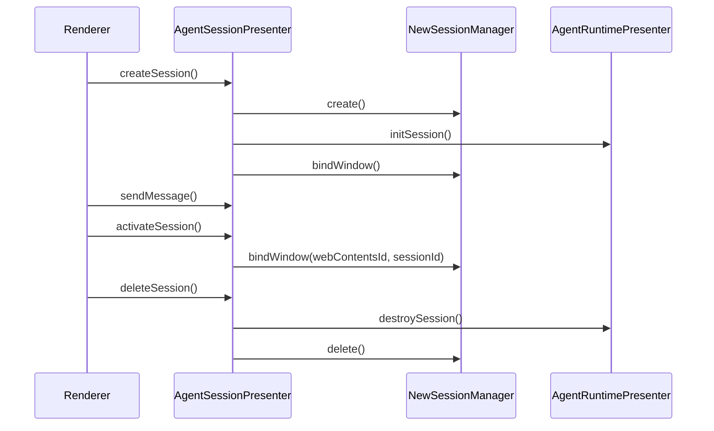

# 会话管理架构详解

retirement 之后，会话管理被明确拆成两层：

- 活跃聊天层：`agentSessionPresenter` + `NewSessionManager`
- 兼容数据层：`SessionPresenter`

## 当前职责边界

| 组件 | 位置 | 当前职责 |
| --- | --- | --- |
| `AgentSessionPresenter` | `src/main/presenter/agentSessionPresenter/index.ts` | renderer 唯一 session 入口 |
| `NewSessionManager` | `src/main/presenter/agentSessionPresenter/sessionManager.ts` | `new_sessions` 记录、窗口绑定、session CRUD |
| `DeepChatSessionStore` | `src/main/presenter/agentRuntimePresenter/sessionStore.ts` | 活跃 runtime 状态 |
| `DeepChatMessageStore` | `src/main/presenter/agentRuntimePresenter/messageStore.ts` | 新消息持久化、分页读取、结构化内容重组 |
| `SessionPresenter` | `src/main/presenter/sessionPresenter/index.ts` | legacy conversation/thread/export 兼容层 |
| `sessionPresenter/messageFormatter.ts` | `src/main/presenter/sessionPresenter/messageFormatter.ts` | 用户消息上下文格式化与 exporter 复用 |

## 主链路中的 session 生命周期

## `SessionPresenter` 现在做什么

`SessionPresenter` 仍然保留，但只在 main 内部承担这些事情：

- 旧 `conversations/messages` 数据访问
- 旧线程列表广播
- 旧 conversation 导出
- tab 关闭时的兼容清理挂钩
- 旧消息格式化 helper 复用

它不再承担：

- renderer 主聊天入口
- 旧 runtime session memory
- `AgentPresenter` stream/loop 协调

## 清理后的关键变化

- `SessionPresenter.toSession()` 不再依赖 legacy runtime 内存态。
- 旧 `cleanupLegacyConversationRuntime()` 已收口为中性内部清理方法。
- renderer IPC 不再公开 `sessionPresenter`。

## 什么时候还需要看 `SessionPresenter`

只有在以下场景才需要继续进入 `src/main/presenter/sessionPresenter/`：

- 维护旧 conversation 导出
- 调整 legacy import 后的兼容读取
- 排查 thread list 广播与窗口清理
- 维护 exporter 使用的用户消息归一化

如果是当前聊天会话创建、发送消息、取消生成、tool interaction，请直接从
`agentSessionPresenter` 和 `agentRuntimePresenter` 开始读。

## 恢复与历史分页

新的聊天恢复链路已经不再假设“打开会话 = 一次性读取全量消息”：

- `sessions.restore` 只返回最近一页消息，默认 `100` 条
- `sessions.listMessagesPage` 负责继续向更老消息翻页
- renderer `messageStore` 首屏只加载第一页，`ChatPage` 在接近顶部时再拉旧历史

这样可以让大会话恢复保持稳定首屏时间，也把“历史很长”和“首屏可用”两个目标解耦开。

## 当前会话能力

- 会话列表支持 lightweight 分页、按 agent/project/subagent 过滤、固定字母排序和置顶优先。
- `generationSettings` 保存在 session runtime 中，renderer 可通过 `sessions.getGenerationSettings`
  / `sessions.updateGenerationSettings` 读取和更新。
- `sessions.compact` 提供手动上下文压缩；自动压缩默认值来自 agent/settings 配置。
- `sessions.listMessageTraces` 提供消息 trace 查询，不再把 trace 混在消息正文里。
- `sessions.searchHistory` 通过结构化搜索文档表优先走 FTS5，失败时回退 `LIKE`。
- Subagent session 与普通 session 共用表结构，但通过 `sessionKind`、`parentSessionId`、
  `subagentMeta` 区分生命周期和展示。
