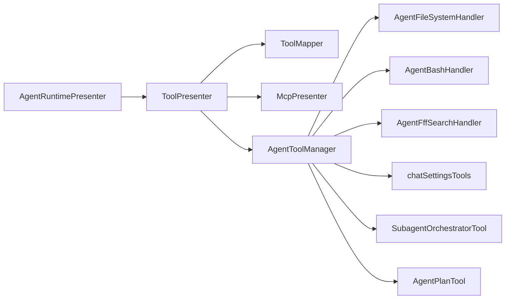
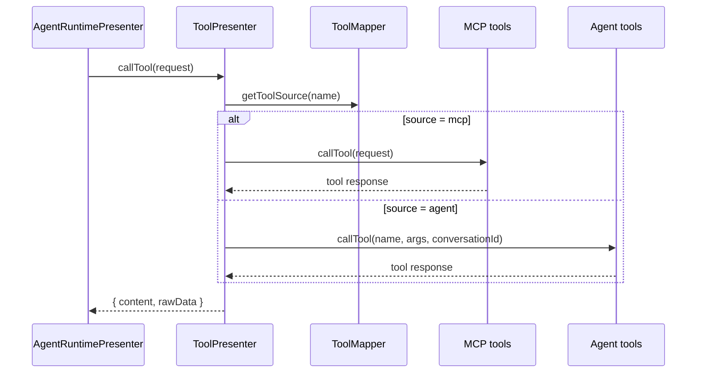

# 工具系统架构详解

本文档反映 retirement 后的工具系统分层。agent tools 已经从旧
`agentPresenter/acp/` 迁移到当前活跃目录。

## 当前组件

| 组件 | 位置 | 职责 |
| --- | --- | --- |
| `ToolPresenter` | `src/main/presenter/toolPresenter/index.ts` | 聚合工具定义、建立映射、路由调用 |
| `ToolMapper` | `src/main/presenter/toolPresenter/toolMapper.ts` | `toolName -> source` 映射 |
| `AgentToolManager` | `src/main/presenter/toolPresenter/agentTools/agentToolManager.ts` | 本地 agent tools 装配与执行 |
| `AgentFileSystemHandler` | `src/main/presenter/toolPresenter/agentTools/agentFileSystemHandler.ts` | 文件系统类工具 |
| `AgentBashHandler` | `src/main/presenter/toolPresenter/agentTools/agentBashHandler.ts` | 命令执行与后台 session |
| `AgentFffSearchHandler` | `src/main/presenter/toolPresenter/agentTools/agentFffSearchHandler.ts` | FFF-backed `glob` / `grep` code search |
| `chatSettingsTools` | `src/main/presenter/toolPresenter/agentTools/chatSettingsTools.ts` | chat/session settings 工具 |
| `SubagentOrchestratorTool` | `src/main/presenter/toolPresenter/agentTools/subagentOrchestratorTool.ts` | subagent orchestration |
| `AgentPlanTool` | `src/main/presenter/toolPresenter/agentTools/agentPlanTool.ts` | `agent-core/update_plan` |
| `AgentTapeToolHandler` | `src/main/presenter/toolPresenter/agentTools/agentTapeTools.ts` | tape read/merge/discard tools |
| `AgentImageGenerationTool` | `src/main/presenter/toolPresenter/agentTools/agentImageGenerationTool.ts` | image generation tool |
| `McpPresenter` | `src/main/presenter/mcpPresenter/` | 外部 MCP servers 与 tools |
| `ACP helpers` | `src/main/presenter/llmProviderPresenter/acp/` | ACP provider runtime、workdir、config、MCP 映射 |

## 路由关系



## 获取工具定义

`ToolPresenter.getAllToolDefinitions()` 会按顺序做三件事：

1. 从 `mcpPresenter` 拉取 MCP tools。
2. 从 `AgentToolManager` 拉取本地 agent tools。
3. 用 `ToolMapper` 记录来源，并在重名时优先保留 MCP tool。
4. 过滤 disabled agent tools，并为每个 conversation 维护独立映射。

这意味着 `agentRuntimePresenter` 不需要知道 tool 的真实来源，只需要持有统一的
`MCPToolDefinition[]`。

## 调用工具



## 权限与 runtime port

本地 agent tools 不再直接依赖旧 presenter runtime，而是通过明确的 port 注入：

- `src/main/presenter/toolPresenter/runtimePorts.ts`
- `AgentToolRuntimePort`

port 负责提供：

- conversation workdir 解析
- 已批准路径查询
- settings approval 消费
- `agentSessionPresenter` 会话上下文桥接

## FFF Search

Agent code/file search uses `@ff-labs/fff-node` through `AgentFffSearchHandler`.

Current model-facing search tools:

| Tool | Backing API | Output |
| --- | --- | --- |
| `glob` | `FffSearchService.findFiles()` | JSON file hits with `path` and score |
| `grep` | `FffSearchService.grep()` | JSON line hits with `path`, `lineNumber`, snippet, and score |

Search policy:

- Agent prompts should prefer `glob -> grep -> read`.
- Shell search commands are outside the model-facing code search path.
- FFF unavailable errors stay tool errors.
- Tool metadata reports `source: "fff"` so downstream rendering/debug paths can identify search
  origin.

权限能力拆分：

- 文件访问：`filePermissionService`
- settings 变更：`settingsPermissionService`
- shell/command：`CommandPermissionService`

## ACP 相关 helper

ACP provider 仍然是活跃能力，但它的 helper 已经迁到 provider 层：

```text
src/main/presenter/llmProviderPresenter/acp/
├── acpProcessManager.ts
├── acpSessionManager.ts
├── acpSessionPersistence.ts
├── acpConfigState.ts
├── acpCapabilities.ts
├── acpContentMapper.ts
├── acpFsHandler.ts
├── acpMessageFormatter.ts
├── acpTerminalManager.ts
├── mcpConfigConverter.ts
├── mcpTransportFilter.ts
└── types.ts
```

这些模块现在只服务于 `LLMProviderPresenter` / `AcpProvider`，不再依附 legacy
`AgentPresenter`。

## 调试建议

排查工具问题时，优先顺序：

1. `src/main/presenter/toolPresenter/index.ts`
2. `src/main/presenter/toolPresenter/toolMapper.ts`
3. `src/main/presenter/toolPresenter/agentTools/agentToolManager.ts`
4. 具体 handler
5. `src/main/presenter/mcpPresenter/toolManager.ts`

如果看到旧路径 `src/main/presenter/agentPresenter/acp/*`，那属于已经归档的历史实现。
